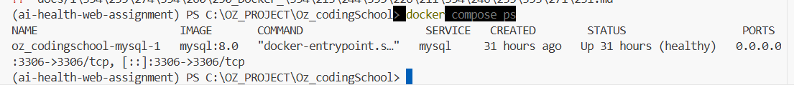
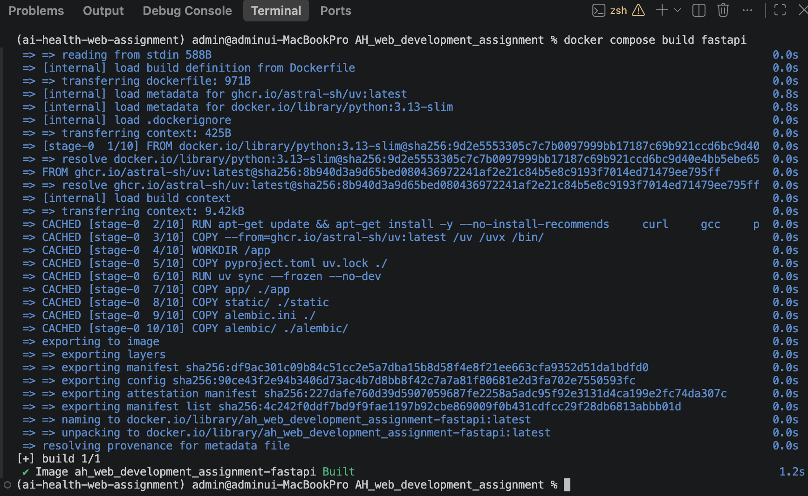
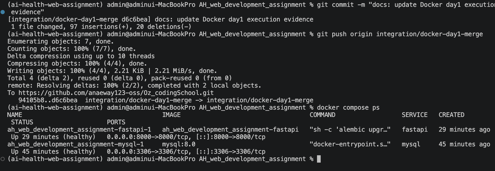

# Docker 웹 서비스 배포 1일차 실행 증빙

## 1. 작업 개요

Docker 웹 서비스 배포 1일차에서 `.dockerignore` 작성, FastAPI Docker 이미지 구성,
MySQL 컨테이너 실행 및 FastAPI와 MySQL 연동 상태를 확인했습니다.

주요 확인 항목은 다음과 같습니다.

- `.dockerignore` 작성 및 제외 대상 검토
- Docker 이미지 빌드 성공 여부 확인
- FastAPI 컨테이너 실행 여부 확인
- MySQL 컨테이너 실행 및 health 상태 확인
- Alembic 마이그레이션 적용 확인
- Docker 환경에서 FastAPI / MySQL 연동 확인
- Swagger를 통한 API 정상 동작 확인

---

## 2. .dockerignore 작성

Docker 이미지에 불필요하거나 포함하면 안 되는 파일을 제외하기 위해
프로젝트 루트에 `.dockerignore`를 작성했습니다.

주요 제외 대상:

- Python 캐시 (`__pycache__`, `*.pyc` 등)
- 환경변수 및 민감 파일 (`.env`, `.env.*`)
- Python 가상환경 (`.venv`, `venv`)
- 테스트 및 도구 캐시
- 로그 파일
- IDE 설정 파일
- OS 임시 파일
- Git 관련 파일
- Docker 이미지에 필요하지 않은 문서 파일

애플리케이션 실행에 필요한 Python 소스와 디렉터리는 제외하지 않았습니다.

---

## 3. MySQL 컨테이너 실행 확인

`docker compose ps`를 통해 MySQL 컨테이너가 정상 실행 중이며
health check를 통과한 `healthy` 상태임을 확인했습니다.

확인 결과:

- Service: `mysql`
- Image: `mysql:8.0`
- Container: `ah_web_development_assignment-mysql-1`
- Status: `Up (healthy)`
- Port: `3306`

또한 Docker 환경의 MySQL에서 실제 SQL 명령이 정상 처리되는지 확인하기 위해
`SELECT 1;`을 실행했고 정상 결과를 확인했습니다.

Alembic 마이그레이션 적용 후 다음 테이블이 생성된 것도 확인했습니다.

- `users`
- `patients`
- `medical_records`
- `xray_images`
- `ai_analysis_results`
- `alembic_version`

### 실행 화면



MySQL 담당 작업 단계에서 컨테이너가 `healthy` 상태로 정상 실행되는 것을 확인했습니다.
이후 최종 통합 단계에서는 FastAPI와 MySQL을 함께 실행하여 전체 Docker Compose 구성을 추가 검증했습니다.

---

## 4. FastAPI 컨테이너 및 MySQL 연동 확인

`app/Dockerfile`을 기반으로 FastAPI Docker 이미지를 빌드했으며
정상적으로 빌드가 완료되었습니다.

### FastAPI Docker 이미지 빌드 성공 화면



`docker compose build fastapi` 실행 결과 FastAPI Docker 이미지가 정상적으로 빌드되었음을 확인했습니다.

Docker Compose를 통해 FastAPI와 MySQL 컨테이너를 함께 실행한 결과
두 컨테이너 모두 `healthy` 상태임을 확인했습니다.

### FastAPI / MySQL 동시 실행 화면



`docker compose ps` 실행 결과 FastAPI와 MySQL 컨테이너가 모두 `Up (healthy)` 상태로 정상 실행 중임을 확인했습니다.

FastAPI의 `/healthcheck` 엔드포인트를 호출한 결과
다음과 같이 정상 응답을 확인했습니다.

```json
{"status":"ok"}
```

또한 Docker 환경에서 Swagger UI가 정상적으로 실행되는 것을 확인했습니다.

Swagger 접속 주소:

`http://127.0.0.1:8000/docs`

Swagger의 `POST /users/signup` API를 이용하여 테스트 회원가입을 실행했고
`201 Created` 응답을 확인했습니다.

이를 통해 다음 흐름이 정상적으로 동작함을 확인했습니다.

- Swagger → FastAPI 요청 전달
- FastAPI → MySQL 연결
- MySQL `users` 테이블 조회 및 데이터 저장
- 회원가입 결과 정상 응답

---

## 5. Alembic 자동 마이그레이션 적용

새로운 Docker MySQL 환경에서는 처음 실행할 때
애플리케이션에서 사용하는 테이블이 존재하지 않을 수 있습니다.

이를 해결하기 위해 Docker 이미지에 다음 Alembic 파일을 포함했습니다.

- `alembic.ini`
- `alembic/`

또한 FastAPI 컨테이너 실행 시 다음 명령이 먼저 실행되도록
`docker-compose.yml`을 구성했습니다.

```bash
alembic upgrade head
```

Alembic 마이그레이션이 정상적으로 완료된 경우에만
FastAPI 서버가 실행되도록 다음 순서로 구성했습니다.

```text
MySQL 컨테이너 healthy
        ↓
alembic upgrade head
        ↓
DB 최신 마이그레이션 적용
        ↓
Uvicorn / FastAPI 실행
```

FastAPI 컨테이너 로그에서도 Alembic 실행 후
Uvicorn 서버가 정상적으로 시작되는 것을 확인했습니다.

---

## 6. 최종 진행 상태

- [x] `.dockerignore` 작성
- [x] 민감 파일 및 불필요 파일 제외 규칙 확인
- [x] 실행에 필요한 애플리케이션 파일 제외 여부 확인
- [x] FastAPI Docker 이미지 빌드 성공 확인
- [x] MySQL 컨테이너 실행 및 healthy 상태 확인
- [x] FastAPI 컨테이너 실행 및 healthy 상태 확인
- [x] FastAPI `/healthcheck` 200 응답 확인
- [x] MySQL SQL 실행 확인
- [x] Alembic 마이그레이션 적용 및 테이블 생성 확인
- [x] FastAPI / MySQL 연결 확인
- [x] Swagger 회원가입 API `201 Created` 확인
- [x] 컨테이너 시작 시 Alembic 자동 마이그레이션 실행 확인
- [x] 최종 실행 증빙 이미지 추가

Docker 1일차의 Docker 이미지 빌드, FastAPI / MySQL 컨테이너 실행,
DB 마이그레이션 및 실제 API 연동 테스트까지 최종 확인했습니다.

최종 실행 증빙 이미지를 `docs/images`에 추가하여 Docker 1일차 실행 결과를 최종 정리했습니다.
