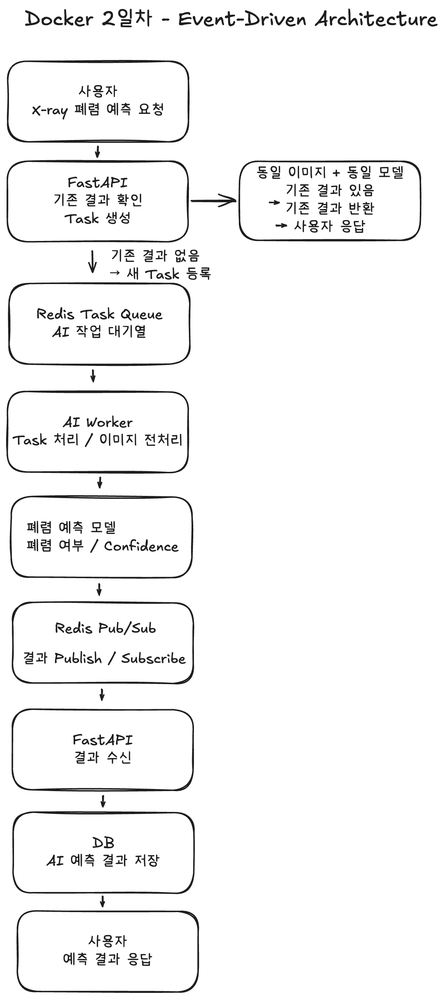

# Docker 2일차 동시성 문제 해결을 위한 Event-Driven Architecture 설계

## 1. 과제 개요

FastAPI와 Redis를 활용한 Event-Driven Architecture를 학습하고,
폐렴 예측처럼 처리 시간이 긴 AI 작업에서 발생할 수 있는 동시성 문제를 해결하기 위한 아키텍처를 설계합니다.

이번 설계의 핵심은 다음과 같습니다.

- FastAPI와 AI Worker의 역할을 분리합니다.
- Redis를 AI 작업 대기열(Task Queue)로 활용합니다.
- AI Worker는 폐렴 예측 모델의 추론을 담당합니다.
- AI Worker의 예측 결과는 Redis Pub/Sub을 통해 FastAPI에 전달합니다.
- FastAPI가 최종 결과를 DB에 저장하고 사용자에게 응답합니다.

이 설계는 Docker 3일차에서 실제 코드로 구현할 구조의 기준으로 사용합니다.

---

## 2. 기존 동기 처리 방식과 동시성 문제

기존 동기 처리 방식에서는 사용자가 폐렴 예측을 요청하면
FastAPI가 요청 처리부터 이미지 전처리, AI 모델 추론, 결과 저장까지 모두 담당할 수 있습니다.

하지만 AI 모델 추론처럼 시간이 오래 걸리는 작업을 FastAPI가 직접 수행하면 다음 문제가 발생할 수 있습니다.

- AI 추론이 끝날 때까지 API 요청 처리 시간이 길어질 수 있습니다.
- 여러 사용자가 동시에 요청하면 FastAPI 서버의 부하가 증가할 수 있습니다.
- 무거운 AI 연산 때문에 다른 일반 API 요청도 지연될 수 있습니다.
- 동일 이미지와 동일 모델의 요청이 반복되면 불필요한 중복 추론이 발생할 수 있습니다.
- AI 모델 처리 과정의 장애가 웹 API 서버에도 영향을 줄 수 있습니다.

따라서 웹 요청을 처리하는 FastAPI와
AI 모델 추론을 담당하는 AI Worker를 분리할 필요가 있습니다.

---

## 3. Event-Driven Architecture

Event-Driven Architecture는 특정 작업이나 사건이 발생했을 때
이벤트 또는 메시지를 전달하고 각 구성 요소가 자신의 역할을 독립적으로 수행하도록 구성하는 방식입니다.

이번 프로젝트에서는 다음과 같이 역할을 나눕니다.

- Producer: FastAPI
- 작업 대기열: Redis Task Queue
- Consumer: AI Worker
- 결과 전달: Redis Pub/Sub
- 결과 저장: FastAPI → DB

FastAPI가 폐렴 예측 작업을 Redis Task Queue에 등록하면
AI Worker가 작업을 가져와 모델 추론을 수행합니다.

AI Worker는 DB에 직접 결과를 저장하지 않고
예측 완료 결과를 Redis Pub/Sub을 이용해 FastAPI에 전달합니다.

FastAPI는 결과를 전달받은 뒤 DB에 저장하고
최종 결과를 사용자에게 반환합니다.

---

## 4. FastAPI의 역할

FastAPI는 사용자의 HTTP 요청을 처리하는 웹 API 서버이면서
AI 예측 작업을 생성하는 Producer 역할을 담당합니다.

주요 역할은 다음과 같습니다.

1. 사용자의 폐렴 예측 요청을 받습니다.
2. 인증 및 권한을 확인합니다.
3. 진료기록과 X-ray 이미지 정보를 확인합니다.
4. 동일 이미지와 동일 모델의 기존 예측 결과가 DB에 존재하는지 확인합니다.
5. 기존 결과가 있으면 AI 추론을 다시 실행하지 않고 저장된 결과를 반환합니다.
6. 새로운 예측이 필요한 경우 AI 예측 Task를 생성합니다.
7. Task를 Redis Task Queue에 등록합니다.
8. AI Worker가 Publish한 결과를 Redis Pub/Sub을 통해 전달받습니다.
9. 전달받은 예측 결과를 DB에 저장합니다.
10. 최종 예측 결과를 사용자에게 반환합니다.

FastAPI는 직접 AI 모델 추론을 수행하지 않습니다.

---

## 5. Redis와 작업 Queue

Redis는 메모리를 기반으로 빠르게 데이터를 처리하는 데이터 저장소로,
캐시, 메시지 전달, 작업 대기열 등의 용도로 활용할 수 있습니다.

이번 프로젝트에서는 Redis를 크게 두 가지 용도로 사용합니다.

### 5-1. Redis Task Queue

FastAPI가 생성한 AI 예측 작업을
AI Worker가 처리할 때까지 보관하는 작업 대기열입니다.

    FastAPI
       ↓
    Redis Task Queue
       ↓
    AI Worker

여러 사용자의 요청이 동시에 들어오더라도
작업을 Redis Queue에 대기시킨 뒤 Worker가 처리 가능한 작업부터 가져가 처리할 수 있습니다.

Task에는 Worker가 예측을 수행하는 데 필요한 정보를 전달합니다.

예시 정보:

- task_id
- record_id
- X-ray 이미지 경로
- 사용할 AI 모델명

### 5-2. Redis Pub/Sub

AI Worker가 예측을 완료한 후
예측 결과를 FastAPI에 전달하기 위해 사용합니다.

    AI Worker
       ↓ Publish
    Redis Pub/Sub
       ↓ Subscribe
    FastAPI

즉 두 기능의 역할은 다음과 같습니다.

- Task Queue: 처리해야 할 AI 작업을 전달하고 대기시키는 구조
- Pub/Sub: 완료된 AI 예측 결과를 FastAPI에 전달하는 구조

### 5-3. Redis Streams 참고

Redis Streams는 메시지를 저장하고 처리할 수 있는 Redis의 데이터 구조입니다.

이번 Docker 3일차 구현에서는 과제에서 제시한 흐름에 맞추어
Task Queue와 Pub/Sub을 중심으로 사용합니다.

따라서 Redis Streams는 참고 가능한 다른 메시지 처리 방식으로 정리하고,
Redis Streams와 Redis Streaming을 서로 다른 핵심 기술처럼 구분하지 않습니다.

---

## 6. AI Worker의 역할

AI Worker는 Redis Task Queue에서 작업을 가져와
실제 폐렴 예측 모델 추론을 수행하는 Consumer입니다.

주요 역할은 다음과 같습니다.

1. Redis Task Queue에서 예측 작업을 가져옵니다.
2. 전달받은 X-ray 이미지 정보를 확인합니다.
3. 이미지를 불러오고 모델 입력 형식에 맞게 전처리합니다.
4. 폐렴 예측 모델을 이용하여 추론을 수행합니다.
5. 폐렴 여부와 Confidence 등의 예측 결과를 생성합니다.
6. 생성된 결과를 Redis Pub/Sub에 Publish합니다.

중요한 점은 AI Worker가 DB 저장을 직접 담당하지 않는다는 것입니다.

AI Worker는 AI 추론과 결과 Publish까지 담당하고,
DB 저장은 결과를 Subscribe한 FastAPI가 담당합니다.

---

## 7. FastAPI와 AI Worker를 분리하는 이유

### 7-1. 웹 요청 처리와 AI 연산 분리

FastAPI가 무거운 AI 모델 추론을 직접 수행하지 않기 때문에
AI 연산으로 인해 일반 API 요청이 지연되는 문제를 줄일 수 있습니다.

### 7-2. 역할 명확화

FastAPI의 역할:

- 사용자 요청 처리
- 인증 및 데이터 확인
- 기존 예측 결과 확인
- Redis Queue에 Task 등록
- AI 결과 Subscribe
- DB 저장
- 최종 응답

AI Worker의 역할:

- Redis Queue에서 Task 가져오기
- X-ray 이미지 전처리
- AI 모델 추론
- 결과 Publish

### 7-3. 확장성

AI 요청이 많아질 경우
FastAPI 전체를 변경하지 않고 AI Worker의 개수를 별도로 늘릴 수 있습니다.

### 7-4. 장애 격리

AI 모델 실행 과정에서 Worker에 문제가 발생하더라도
웹 API 서버와 AI 실행 환경이 분리되어 있기 때문에 영향을 줄일 수 있습니다.

### 7-5. 동시 요청 관리

Redis Queue를 통해 여러 AI 작업을 대기시킨 후
Worker가 처리 가능한 범위에서 작업을 가져가도록 관리할 수 있습니다.

---

## 8. 전체 요청 처리 흐름

Docker 3일차 구현까지 고려한 최종 처리 흐름은 다음과 같습니다.

    사용자
      ↓
    FastAPI
      ↓
    동일 이미지 + 동일 모델의 기존 DB 결과 확인
      │
      ├─ 기존 결과 있음
      │      ↓
      │   기존 결과 반환
      │
      └─ 기존 결과 없음
             ↓
       Redis Task Queue
             ↓
          AI Worker
             ↓
         X-ray 전처리
             ↓
       폐렴 예측 모델 추론
             ↓
      폐렴 여부 / Confidence 생성
             ↓
        Redis Pub/Sub
             ↓
           FastAPI
             ↓
           DB 저장
             ↓
          사용자 응답

핵심 서비스 흐름은 다음과 같습니다.

    FastAPI
      ↓
    Redis Task Queue
      ↓
    AI Worker
      ↓
    폐렴 예측 모델
      ↓
    Redis Pub/Sub
      ↓
    FastAPI
      ↓
    DB

---

## 9. Event-Driven Architecture 설계도

Excalidraw를 이용하여
FastAPI와 AI Worker의 역할이 분리된 Event-Driven Architecture를 설계합니다.

최종 설계도에서는 다음 흐름이 명확하게 표현되어야 합니다.

    FastAPI
      ↓
    Redis Task Queue
      ↓
    AI Worker
      ↓
    폐렴 예측 모델
      ↓
    Redis Pub/Sub
      ↓
    FastAPI
      ↓
    DB 저장

또한 동일 이미지와 동일 모델의 기존 예측 결과가 존재하는 경우
AI Worker를 다시 호출하지 않고 기존 DB 결과를 반환하는 흐름을 고려합니다.

현재 설계 이미지는 Docker 3일차 구현 구조에 맞게 최종 수정 후 반영합니다.

---

## 10. 설계 선택 이유 및 기대 효과

이번 구조를 선택한 가장 큰 이유는
FastAPI와 AI 모델 추론 작업을 분리하여
동시 요청 상황에서도 안정적인 서비스를 구성하기 위해서입니다.

Redis Task Queue를 사용하면 여러 AI 요청이 동시에 들어오더라도
Worker가 처리할 수 있을 때까지 작업을 대기시킬 수 있습니다.

또한 AI Worker의 결과를 Redis Pub/Sub을 통해 FastAPI로 전달하면
AI Worker는 AI 추론에 집중하고
FastAPI는 DB 저장과 사용자 응답을 담당할 수 있습니다.

기대 효과는 다음과 같습니다.

- FastAPI와 AI Worker 역할 명확화
- AI 작업 대기열 관리
- 동시 요청 처리 구조 개선
- AI Worker의 독립적인 확장 가능
- AI 작업 장애와 웹 API 서버의 영향 분리
- 동일 이미지 및 동일 모델의 중복 추론 감소
- Docker 3일차 구현과 자연스럽게 연결

---

## 11. Docker 3일차 구현 연결 기준

Docker 2일차에서 설계한 구조는
3일차에서 실제 FastAPI, Redis, AI Worker 코드로 구현합니다.

### 11-1. FastAPI

예정 파일:

- app/core/redis_client.py

구현 내용:

- Redis 비동기 클라이언트 연결
- 동일 이미지 + 동일 모델의 기존 DB 결과 확인
- Redis Task Queue에 폐렴 예측 Task 등록
- AI Worker 결과 Subscribe
- 결과 DB 저장
- 사용자에게 최종 결과 응답

### 11-2. AI Worker

예정 파일:

- worker/redis_client.py
- worker/main.py

구현 내용:

- Redis 연결
- Task Queue에서 작업 가져오기
- 폐렴 예측 모델 추론
- 예측 결과 Publish

### 11-3. Docker

예정 파일:

- worker/Dockerfile
- docker-compose.yml

FastAPI와 AI Worker를 서로 다른 Docker 서비스로 분리하여 실행합니다.

Docker 3일차 최종 구현 기준은 다음과 같습니다.

    FastAPI 요청
      ↓
    Redis Queue에 폐렴 예측 Task 삽입
      ↓
    AI Worker가 Task 가져오기
      ↓
    폐렴 예측 모델 실행
      ↓
    Pub/Sub으로 결과 전달
      ↓
    FastAPI가 결과 수신
      ↓
    FastAPI가 DB 저장
      ↓
    사용자에게 결과 응답

---

## 12. 팀 최종 아키텍처 기준

팀원별 학습 문서는 각 담당자가 조사한 내용을 보존합니다.

다만 Docker 3일차 실제 구현과 연결되는
팀의 최종 아키텍처 기준은 본 문서의 흐름으로 통일합니다.

최종 기준:

- FastAPI = Producer
- Redis Task Queue = AI 작업 대기열
- AI Worker = Consumer
- AI Worker = AI 모델 추론 담당
- Redis Pub/Sub = AI Worker 결과 전달
- FastAPI = 결과 Subscribe 및 DB 저장
- 동일 이미지 + 동일 모델의 기존 결과가 존재하면 재추론하지 않음

특히 최종 구조는

    AI Worker
      ↓
    Redis Pub/Sub
      ↓
    FastAPI
      ↓
    DB

로 통일합니다.

---

## 13. 최종 완료 조건 확인

- [x] FastAPI + Redis 기반 Event-Driven Architecture 학습 내용 정리
- [x] 기존 동기 처리 방식과 동시성 문제 정리
- [x] FastAPI와 AI Worker 역할 분리 표현
- [x] Redis Task Queue 구조 표현
- [x] Redis Pub/Sub 결과 전달 구조 표현
- [x] FastAPI가 DB 저장을 담당하는 구조 명확화
- [x] 동일 이미지 + 동일 모델 중복 추론 방지 흐름 반영
- [x] Docker 3일차 구현 구조와 연결
- [x] 팀원별 학습 내용을 최종 아키텍처 기준으로 통합
- [x] Excalidraw 아키텍처 설계도를 최종 흐름에 맞게 수정
- [x] 수정된 아키텍처 이미지를 문서에 반영
- [ ] 최종 PR을 통해 main 브랜치에 병합

---

## 14. 참고 자료

### FastAPI

- FastAPI 공식 문서 - Concurrency and async / await
  - https://fastapi.tiangolo.com/async/

### Redis

- Redis 공식 문서 - Lists
  - https://redis.io/docs/latest/develop/data-types/lists/
- Redis 공식 문서 - Job Queue
  - https://redis.io/docs/latest/develop/use-cases/job-queue/
- Redis 공식 문서 - Pub/Sub
  - https://redis.io/docs/latest/develop/pubsub/
- Redis 공식 문서 - Streams
  - https://redis.io/docs/latest/develop/data-types/streams/

### Architecture

- Microsoft Azure Architecture Center - Event-Driven Architecture
  - https://learn.microsoft.com/azure/architecture/guide/architecture-styles/event-driven

### 수업 자료

- OZ 코딩스쿨 Docker 웹 서비스 배포 Stage 2
- OZ 코딩스쿨 Docker 웹 서비스 배포 Stage 3
