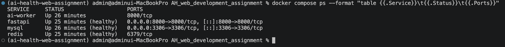
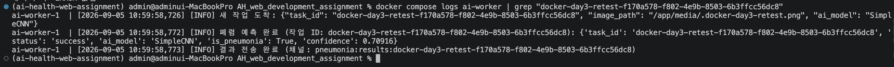
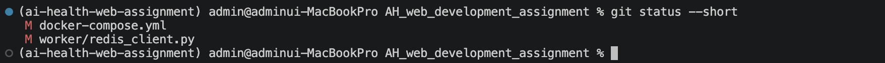

# Docker 3일차 최종 통합 및 실행 증빙

## 1. 작업 목표

Docker 2일차에 설계한 Event-Driven Architecture를 실제 코드와 Docker 환경에 연결하고,
FastAPI, Redis, AI Worker, SimpleCNN이 하나의 흐름으로 동작하는지 최종 통합 검증했습니다.

설계한 전체 흐름은 다음과 같습니다.

    FastAPI
      ↓
    Redis Task Queue
      ↓
    AI Worker
      ↓
    SimpleCNN 폐렴 예측
      ↓
    Redis Pub/Sub
      ↓
    FastAPI
      ↓
    DB 저장 및 사용자 응답

3일차에서는 성규님, 수빈님, 효민님의 담당 작업을 통합한 뒤
Docker Compose 환경에서 Redis와 AI Worker가 실제로 함께 동작하는지 확인했습니다.

---

## 2. Docker Compose 최종 구성

최종 Docker Compose 환경에서는 다음 4개 서비스를 함께 실행했습니다.

- `fastapi`
- `mysql`
- `redis`
- `ai-worker`

`ai-worker`는 `python worker/main.py` 명령으로 실행되며,
Redis Task Queue에서 작업을 기다리도록 구성했습니다.

FastAPI와 AI Worker가 동일한 X-ray 파일을 읽을 수 있도록 다음 볼륨을 공유했습니다.

    media_volume:/app/media

AI Worker의 Redis 연결 환경변수는 다음과 같습니다.

    REDIS_HOST=redis
    REDIS_PORT=6379
    REDIS_DB=0

### 실행 결과

확인 결과:

- FastAPI 정상 실행 및 `healthy`
- MySQL 정상 실행 및 `healthy`
- Redis 정상 실행 및 `healthy`
- AI Worker 정상 실행
- 4개 서비스가 Docker Compose 환경에서 동시에 실행되는 것을 확인

---

## 3. Redis Queue → AI Worker → SimpleCNN → Pub/Sub 검증

AI Worker는 다음 Redis Queue에서 작업을 기다립니다.

    pneumonia:tasks

작업 수신 후 다음 순서로 처리합니다.

1. Redis Queue에서 작업 수신
2. 전달받은 X-ray 이미지 경로 확인
3. SimpleCNN 모델로 폐렴 예측
4. 예측 결과 생성
5. 작업별 Redis Pub/Sub 채널로 결과 전송

결과 채널 형식:

    pneumonia:results:{task_id}

성공 결과에는 다음 정보가 포함됩니다.

- `task_id`
- `status`
- `ai_model`
- `is_pneumonia`
- `confidence`

### 실제 재검증 결과

최종 통합 수정 후 다음 `task_id`로 다시 테스트했습니다.

    docker-day3-retest-f170a578-f802-4e9b-8503-6b3ffcc56dc8

확인 결과:

- Redis Queue 작업 수신 성공
- SimpleCNN 예측 성공
- `status: success` 확인
- `ai_model: SimpleCNN` 확인
- `is_pneumonia` 반환 확인
- `confidence` 반환 확인
- Redis Pub/Sub 결과 전송 성공

---

## 4. Worker Redis Timeout 문제 확인 및 해결

최종 통합 검증 중 AI Worker가 빈 Queue에서 작업을 기다릴 때 다음 오류가 반복되는 현상을 발견했습니다.

    Timeout reading from socket

원인을 확인한 결과 Worker는 `BRPOP timeout=0`을 사용하여 Redis Queue에서 작업을 계속 기다리도록 설계되어 있었지만,
Redis Client의 socket read timeout 설정과 대기 방식이 맞지 않아 timeout 오류가 발생하고 있었습니다.

Redis 서버 자체의 장애나 재시작 문제는 아니었습니다.

따라서 `worker/redis_client.py`에 다음 설정을 한 줄 추가했습니다.

    socket_timeout=None,

이 수정은 Queue 이름, Pub/Sub 규칙, FastAPI Redis Client, DB 및 API 구조에는 영향을 주지 않고
AI Worker의 BRPOP 대기 방식만 정상적으로 유지하기 위한 최소 수정입니다.

수정 후 다음 내용을 다시 확인했습니다.

- 실행 중인 AI Worker 컨테이너에서 `socket_timeout=None` 적용 확인
- AI Worker 컨테이너 재시작
- 재시작 이후 ERROR 없음 확인
- Queue → Worker → SimpleCNN → Pub/Sub 재테스트 성공

---

## 5. 최종 변경 파일

최종 통합 과정에서 변경된 파일은 다음 두 개입니다.

- `docker-compose.yml`
- `worker/redis_client.py`

### docker-compose.yml

주요 변경 내용:

- `ai-worker` 서비스 추가
- Worker 실행 명령 설정
- Redis 환경변수 설정
- `worker/` 폴더 연결
- FastAPI와 `media_volume` 공유
- Redis가 healthy 상태가 된 뒤 Worker 실행

### worker/redis_client.py

주요 변경 내용:

    socket_timeout=None,

Redis `BRPOP`의 무기한 대기 설계와 Client socket timeout 설정을 일치시키기 위한 최소 수정입니다.

---

## 6. 실제 검증 완료 항목

- `docker compose config --quiet` 통과
- Docker daemon 정상 동작
- AI Worker 이미지 Build 성공
- FastAPI / MySQL / Redis / AI Worker 전체 기동 성공
- FastAPI `/healthcheck` → `200 OK`
- FastAPI `healthy`
- MySQL `healthy`
- Redis `healthy`
- AI Worker Redis 연결 성공
- AI Worker가 `pneumonia:tasks` Queue에서 작업 대기하는 로그 확인
- Redis Queue → AI Worker → SimpleCNN → Pub/Sub 실제 성공
- FastAPI의 `enqueue_prediction_and_wait()` → Redis → Worker → Pub/Sub 성공
- 기존 보호 API `/patients`가 인증 없이 `401`을 반환하는 것을 확인
- Worker timeout 문제 수정 후 재검증 성공
- 테스트에 사용한 임시 이미지 정리 확인
- 최종 변경 파일 범위 확인

---

## 7. HTTP 예측 API → DB 저장 E2E 테스트 보류 사유

HTTP 예측 API부터 DB 저장까지의 완전한 수용 테스트는 이번 검증에서는 수행하지 못했습니다.

이유는 Docker, Redis 또는 AI Worker 오류가 아니라
현재 로컬 환경에 테스트를 진행할 수 있는 권한 사용자와 진료 데이터가 준비되어 있지 않았기 때문입니다.

확인된 조건:

- `POST /users/signup` 신규 사용자는 `PENDING` 역할로 생성
- `STAFF` 또는 `ADMIN` 역할 변경에는 기존 ADMIN JWT 필요
- 현재 테스트 가능한 STAFF 또는 ADMIN 사용자 없음
- 환자 데이터 없음
- 진료기록 데이터 없음
- X-ray 데이터 없음
- 초기 ADMIN bootstrap 절차를 확인하지 못함

따라서 테스트만을 위해 DB에 직접 INSERT하거나
인증 구조, DB Schema, Alembic Migration을 임의 수정하지 않았습니다.

기존 ADMIN 계정이 준비되면 다음 전체 흐름을 추가 검증할 수 있습니다.

    HTTP 예측 API
      ↓
    FastAPI
      ↓
    Redis Task Queue
      ↓
    AI Worker
      ↓
    SimpleCNN
      ↓
    Redis Pub/Sub
      ↓
    FastAPI
      ↓
    ai_analysis_results DB 저장

동일 진료기록과 동일 모델로 다시 요청했을 때
기존 저장 결과가 재사용되는 캐시 흐름도 함께 확인할 수 있습니다.

---

## 8. Docker 3일차 최종 결과

Docker 3일차에서 목표로 한 핵심 통합 흐름인

    FastAPI
    → Redis Task Queue
    → AI Worker
    → SimpleCNN
    → Redis Pub/Sub
    → FastAPI

의 실제 동작을 확인했습니다.

Docker Compose 환경에서 다음 4개 서비스가 함께 실행되는 것도 확인했습니다.

- FastAPI
- MySQL
- Redis
- AI Worker

최종 통합 과정에서 발견된 Redis Worker timeout 문제는
원인을 확인한 뒤 최소 수정으로 해결하고 재테스트까지 완료했습니다.

HTTP 예측 API → DB 저장까지의 전체 수용 테스트는
초기 ADMIN bootstrap 및 테스트 데이터 부재로 보류했으며,
실제로 검증하지 않은 내용을 완료한 것으로 기록하지 않았습니다.

## 최종 판정

**Docker / Redis / AI Worker 통합 검증 완료**

HTTP → DB 전체 수용 테스트는 기존 인증 사용자 및 테스트 데이터 준비 후 추가 검증 예정입니다.
