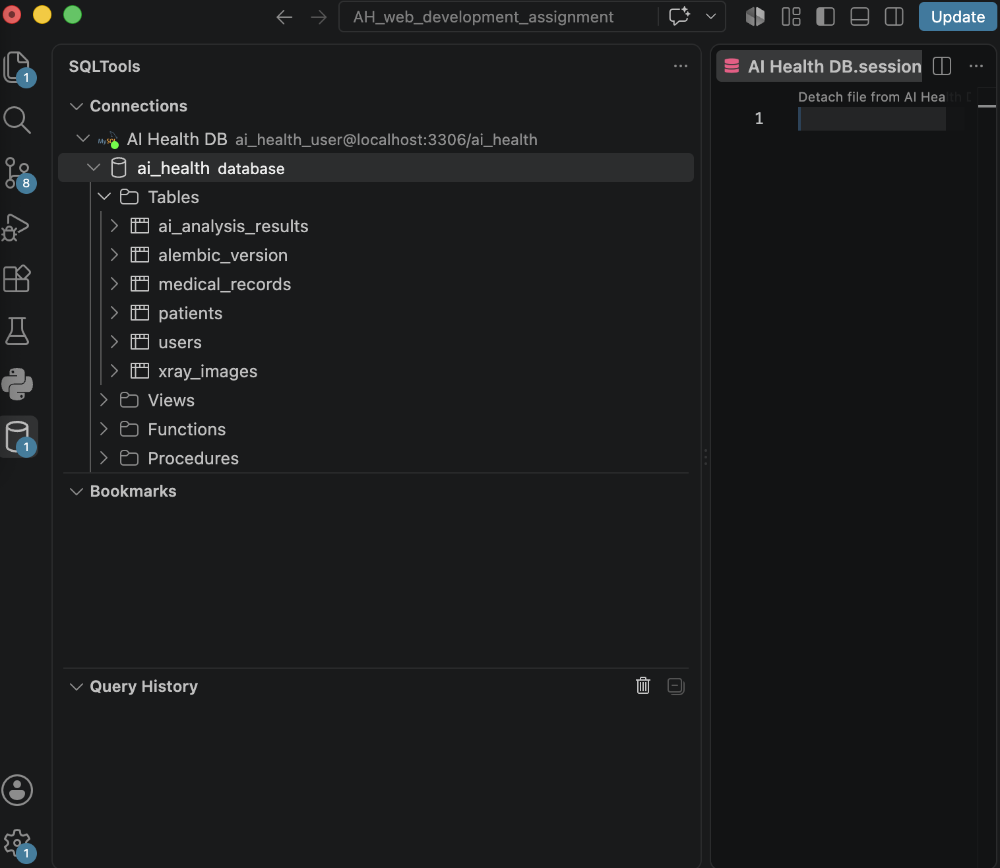

# 3일차 DB 모델 및 Migration

## 1. 데이터베이스 모델 구현

ERD를 기반으로 SQLAlchemy ORM 모델을 구현했습니다.

구현한 주요 테이블은 다음과 같습니다.

- `users`
- `patients`
- `medical_records`
- `xray_images`
- `ai_analysis_results`

각 테이블 간의 관계를 Foreign Key(FK)와 relationship으로 연결했습니다.

## 2. Alembic Migration

작성한 SQLAlchemy 모델을 기반으로 Alembic migration 파일을 생성했습니다.

생성된 migration을 MySQL의 `ai_health` 데이터베이스에 적용하여 실제 테이블이 정상적으로 생성되는 것을 확인했습니다.

## 3. Migration 적용 결과

VS Code의 SQLTools를 통해 MySQL 데이터베이스를 확인한 결과, 다음 테이블이 정상적으로 생성되었습니다.

- `users`
- `patients`
- `medical_records`
- `xray_images`
- `ai_analysis_results`
- `alembic_version`

`alembic_version`은 현재 데이터베이스에 적용된 migration 버전을 Alembic이 관리하기 위해 생성하는 테이블입니다.

## 4. DB Viewer 확인

